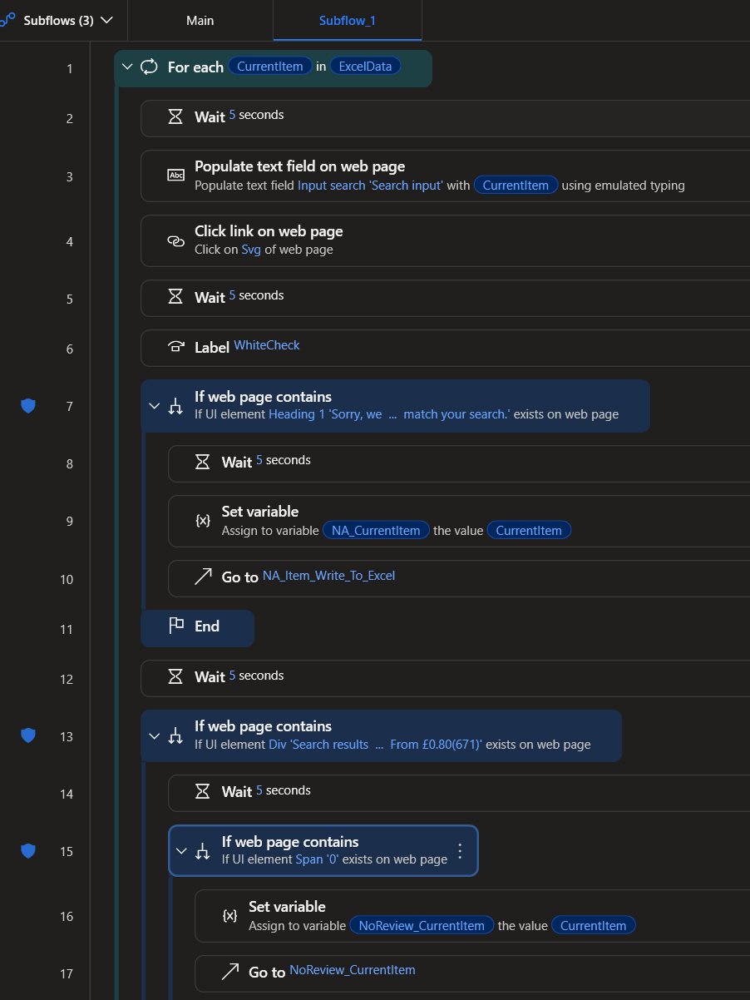
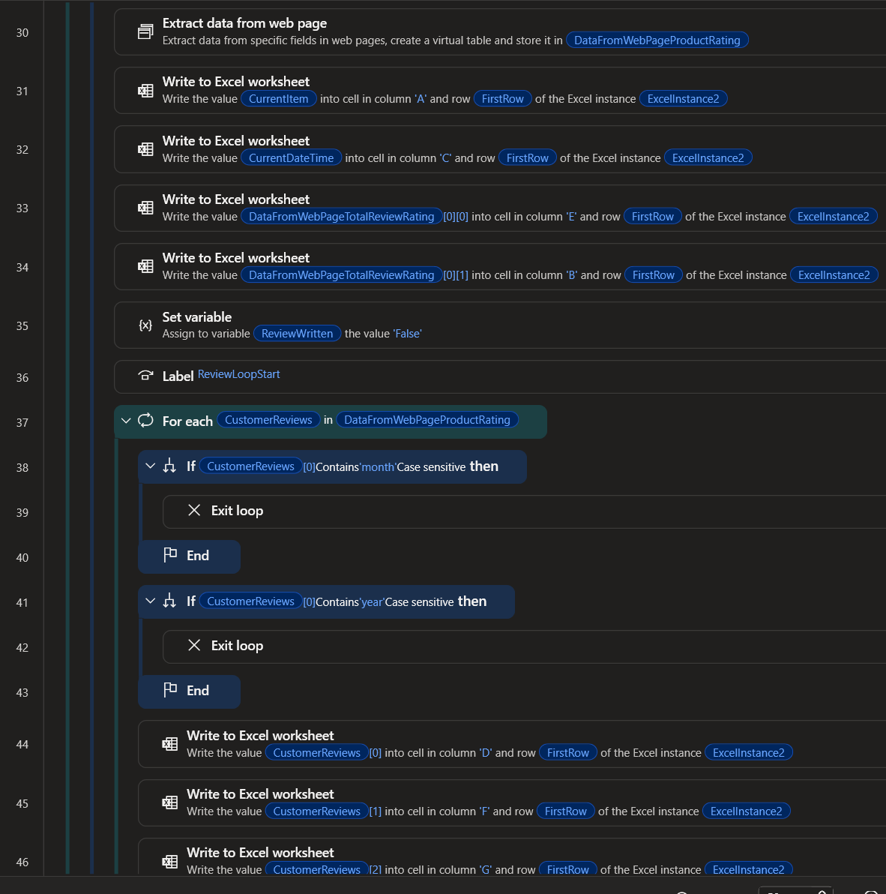
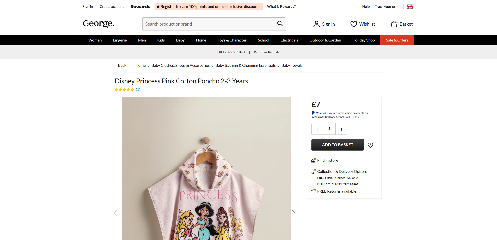

# ASDA Data Extraction — MS Power Automate

A desktop automation built with **Microsoft Power Automate Desktop** that extracts product reviews and ratings from [ASDA.com](https://www.asda.com/) using WIN codes, and writes structured data into an Excel report.

---

## What This Project Does

Given a list of **WIN product codes** in an Excel input file, this automation:

1. Opens ASDA.com in Chrome and searches each product by WIN code
2. Navigates to the product reviews section
3. Extracts product rating, individual reviews, review dates, and recommendation percentage
4. Writes all data into a structured Excel output file
5. Handles unavailable products by marking them as `Item Not Available`

---

## Flow Architecture

### Main Flow

| Step | Action |
|------|--------|
| 1–2 | Launch Excel and open WIN code input files |
| 3 | Read all worksheet cells into `ExcelData` |
| 4 | Close Excel instance |
| 5 | Open output file `Reviews_ASDA.xlsx` |
| 6 | Set `FirstRow = 2` to skip header row |
| 7 | Get current date and time |
| 8 | Launch Chrome and navigate to ASDA.com |
| 9 | Wait 3 seconds |
| 10 | Run Subflow_1 for each WIN code item |

### Subflow — Per Product Logic

- Iterates over each item in `ExcelData`
- Searches product on ASDA.com using WIN code
- If product not found, logs `Item Not Available` and moves to next
- If found, waits for rating element to load and navigates to reviews section
- Loops through individual reviews comparing dates against a threshold
- Writes each valid review row to Excel

---

## Output Columns

| Column | Description |
|--------|-------------|
| WIN Code | Product code used for search |
| Extraction Date | Date and time the data was scraped |
| Period | Review age (e.g. "3 days ago") |
| Total Rating | Overall star rating of the product |
| Overall Rating | Aggregate rating with review count |
| Individual Rating | Star rating of each individual review |

---

## Screenshots

### Input File

### Main Flow

### Subflow Logic

### Data Extraction Steps

### ASDA.com — Source Website

### Output File

---

## Tools Used

| Tool | Purpose |
|------|---------|
| Microsoft Power Automate Desktop | Core automation engine |
| Microsoft Excel | Input (WIN codes) and output (extracted data) |
| Google Chrome | Browser for ASDA.com |
| JavaScript (inline) | Date parsing inside PAD flow |

---

## Setup

**Requirements:**
- Windows 10/11
- Microsoft Power Automate Desktop
- Microsoft Excel
- Google Chrome

**Input Files:**

| File | Path | Description |
|------|------|-------------|
| `WIN Codes.xlsx` | `C:\Fardan\ASDA\` | List of WIN codes |
| `Reviews_ASDA.xlsx` | `C:\Fardan\ASDA\` | Output file (must exist before running) |

> Update file paths in the flow if your directory structure is different.

---

## Known Limitations

- ASDA.com UI changes may break UI element selectors
- Requires a stable internet connection
- File paths are hardcoded and must be updated before use

---

## Author

**Fardan Shoukat** — [github.com/fardan511](https://github.com/fardan511)

---

## License

This project is for educational and personal use only. Web scraping may be subject to a website's Terms of Service — use responsibly.
